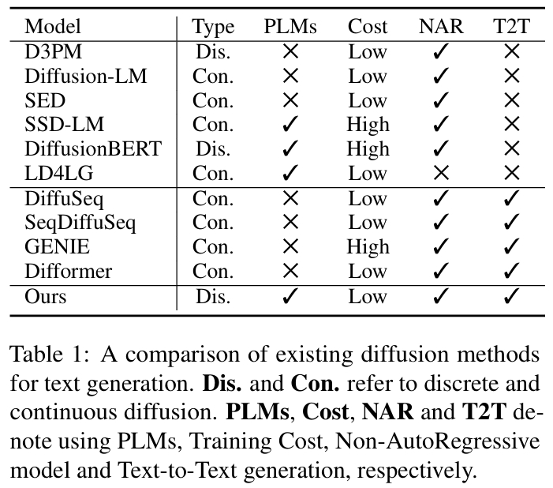
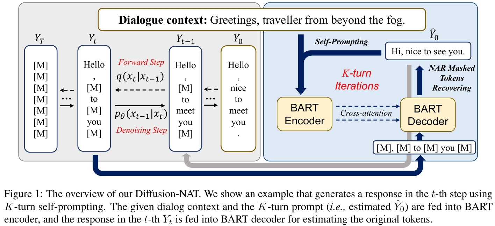
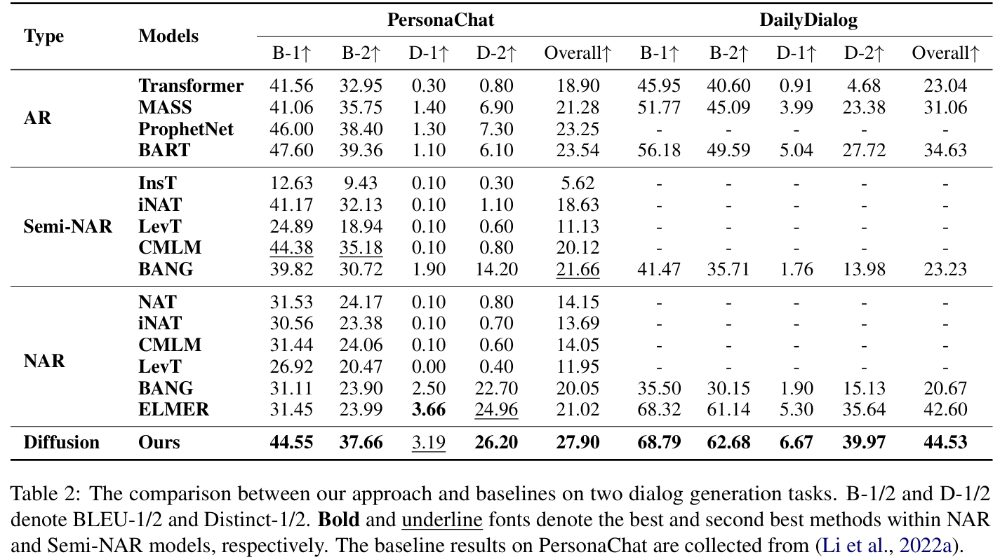
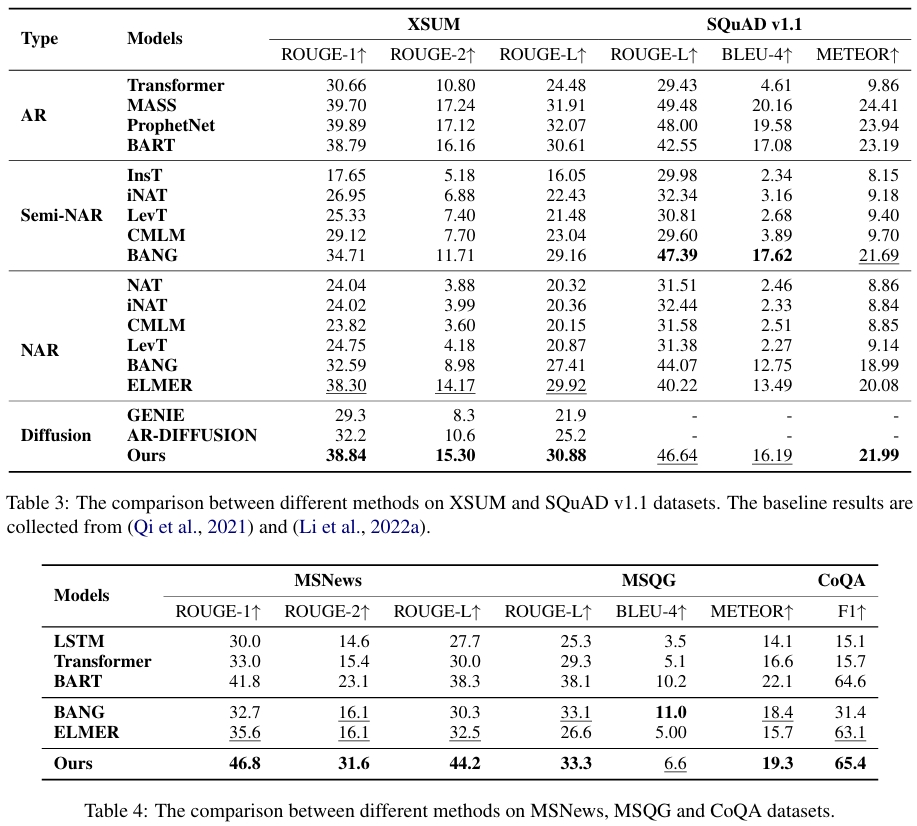
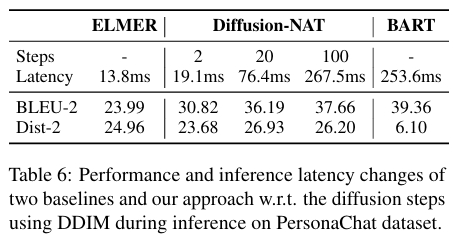

# Diffusion-NAT: Self-Prompting Discrete Diffusion for Non-Autoregressive Text Generation

<p align="center">
  <a href="https://aclanthology.org/2024.eacl-long.86.pdf"><b>[Paper]</b></a> •
  <a href="https://github.com/RUCAIBox/DiffusionNAT"><b>[Code]</b></a>
</p>

## Highlight
#### Our Diffusion-NAT has received the Evaluation and Model Insight Award in EACL 2024. Congratulations to All Authors!!

## Contributions
1.we propose a new solution for integrating Pre-trained LM into Diffusion Model, to perform discrete diffusion for text-to-text generation. It requires only low-cost fine-tuning and can performs better than vanilla fine-tuning;

2.we unify the inference process of PLMs and denoising process of discrete diffusion models, into the same masked token recovering task in the non-autoregressive manner;



### Method


### Experimental Results
We conduct extensive experiments on seven text-to-text generation datasets, where our approach can outperform competitive NAR text generation methods, even surpassing SOTA autoregressive PLMs;





Also, as we can use DDIM for fast inference, we can set the diffusion steps for balancing the inference latency and performance:



## Quick Start
### Setup
```
conda create -n diffusion python=3.10
conda activate diffusion
pip install -r requirements.txt
```

#### Prepare Data
To obtain the data, first download from the [Google-Drive]():
```bash
tar -zxvf datasets.tar.gz
```

### Training
```bash
cd scripts
bash run_train_CNNDM.sh
```

## Citation
If you find this repository helpful, please consider citing our paper:

```
@inproceedings{zhou2024diffusion,
  title={Diffusion-NAT: Self-Prompting Discrete Diffusion for Non-Autoregressive Text Generation},
  author={Zhou, Kun and Li, Yifan and Zhao, Wayne Xin and Wen, Ji-Rong},
  booktitle={Proceedings of the 18th Conference of the European Chapter of the Association for Computational Linguistics (Volume 1: Long Papers)},
  pages={1438--1451},
  year={2024}
}
```